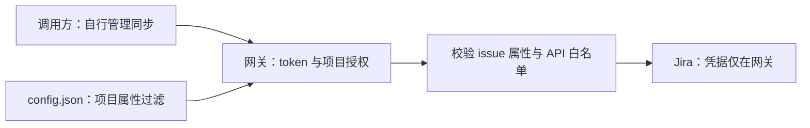

# Jira 受限中转：调用审计与 API 设计

状态：本仓接口已实现，mock 验证见 [验证记录](jira-validation.md)，未部署生产。审计日期：2026-09-14。Zammad 源码来自 `~/source/zammad`，基于 `d52e933d9e`；platform-gateway 基于 `b6cf0ab`。未读取真实凭据或访问生产 Jira。

当前方案以本文件、[调用方 API 文档](jira-api.md)、[统一配置文档](gateway-auth.md)为准，替代之前的工单绑定、同步调度及操作账本方案。本任务不修改 Zammad 源码。

## 1. 职责边界

platform-gateway 负责 token 校验、项目授权、可选 issue 属性过滤、固定 API/字段白名单、上游凭据隔离、请求限额和审计。它是受限 API 中转，不是同步服务。

调用方负责何时查询、定时拉取或 webhook、同步游标、Zammad ticket 与 Jira issue 的绑定、状态和人员映射、评论发布规则、回链、去重、重试及结果不确定时的业务恢复。网关不接收 Zammad ticketId/articleId，不维护绑定名单，不导入工单授权，不签发绑定许可，不调度后台同步。

授权粒度为项目。同一个项目可以配置可选 JQL 过滤以收窄 issue 集合；不配过滤时，该项目中 Jira 服务账号可见的 issue 都可以通过固定 API 访问。不同 token 获准同项目时适用相同过滤，不引入 token 内的 issue 列表或独立策略。

项目授权并非开放任意 Jira 操作：全站管理、删除、transition、任意 REST 路径/URL/JQL，以及白名单外的字段仍不开放。Zammad 失陷后的可访问范围为其 token 授权项目中满足过滤的 issue 及明确允许的字段/操作。

## 2. 现有 Jira API 清单

统一出口是 Zammad [`lib/jira/http_client.rb`](../../zammad/lib/jira/http_client.rb)。API 基址可带 Jira context path。下表按“方法 + 路径模板”计数：15 项有业务调用链，其中若干是条件调用；另有 1 项只定义未见业务使用。

| # | Jira HTTP API | 当前用途 / 调用方 | 网关处理建议 |
|---|---|---|---|
| 1 | `GET /rest/api/2/myself` | Credentials 验证；IssueCreator bot reporter 回退；Resync/CommentProjectionJob 排除 bot 评论 | 内部调用并缓存，只返回必要 bot 身份 |
| 2 | `GET /rest/api/2/project/{projectKey}` | Credentials 验证项目及 issue type | 固定配置项目；对外仅能力摘要 |
| 3 | `GET /rest/api/2/issue/createmeta` | Credentials、IssueCreator 获取创建字段；固定 projectKeys、issuetypeIds，expand=`projects.issuetypes.fields` | 内部缓存、校验白名单；按 Jira 版本适配 |
| 4 | `GET /rest/api/2/mypermissions` | 验证 4 项必需权限及 MODIFY_REPORTER；创建时检查 reporter 权限 | 权限列表、项目由网关固定，不提供任意检查 |
| 5 | `GET /rest/api/2/field` | CustomerPreview 将配置的字段 ID 映射到名称 | 仅本地运维/内部刷新；对外仅配置字段，不泄露全站字段目录 |
| 6 | `GET /rest/api/2/user/assignable/search` | IssueCreator 按创建坐席 email 查候选，精确邮箱唯一匹配后设 reporter | 内部执行；默认 bot，禁止对外人员搜索 |
| 7 | `GET /rest/api/2/issue/{issueKey}` | 侧栏 IssueMetadata、IssueProjector、预览、绑定检查、回链核对、附件恢复 | 检查路径项目及配置属性过滤；固定字段并裁剪响应 |
| 8 | `GET /rest/api/2/issue/{issueKey}/comment` | Resync 分页拉评论；ArticleRelay/ManualBinder 通过 marker 恢复写入 | 父 issue 通过项目及属性过滤后读取；同步处理由调用方完成 |
| 9 | `GET /rest/api/2/issue/{issueKey}/comment/{commentId}` | JiraCommentProjectionJob 收到 webhook 后回查评论 | 校验父 issue 项目、属性过滤和评论归属 |
| 10 | `GET /rest/api/2/search` | JiraPullJob 查最近更新，fields=`key,updated`；IssueCreator 按 operation UUID 查创建恢复，fields=`key,description` | 提供受项目和属性过滤限制的结构化查询；不接受原始 JQL |
| 11 | `POST /rest/api/2/issue` | IssueCreator 创建并持久化 ExternalSync 绑定 | 固定项目/type、创建字段白名单及属性过滤，按请求调用上游 |
| 12 | `POST /rest/api/2/issue/{issueKey}/comment` | ArticleRelay 回传公开文章；ManualBinder 写回链评论 | 校验父 issue；正文、回链和同步 marker 由调用方组织 |
| 13 | `POST /rest/api/2/issue/{issueKey}/attachments` | ArticleRelay 上传文章附件，multipart，`X-Atlassian-Token: no-check` | 父 issue 项目及属性过滤、大小/MIME/总量限制 |
| 14 | `GET {Jira origin}{context}/secure/attachment/...` | ArticleRelay 恢复上传时下载候选并比对 SHA-256 | 提供按父 issue 与 attachmentId 授权的下载，不接受任意 URL |
| 15 | `PUT /rest/api/2/issue/{issueKey}` | ManualBinder 仅修改可选 `backlink_field_id` | 默认禁用；真有需求时只开放“确保回链”业务操作 |
| — | `GET /rest/api/2/serverInfo` | HttpClient 定义 `server_info`，未见 app/lib 业务调用 | 运行时不开放；可由网关部署诊断使用 |

当前没有发现删除 issue/comment/attachment、状态 transition、指派更新、用户/项目管理、批量写入、remote link API 的同步调用。Jira 状态及人员的同步方向是 Jira → Zammad，不需要为此增加 Jira 修改权限。回链通过描述/评论（及可选字段）实现。

关键调用链证据：

- [Credentials](../../zammad/lib/jira/credentials.rb)、[ConfigVerifier](../../zammad/app/services/service/ticket/jira_bridge/config_verifier.rb)：只读验证及权限需求。
- [IssueCreator](../../zammad/app/services/service/ticket/jira_bridge/issue_creator.rb)：字段解析、reporter 回退、创建 marker 和不确定结果恢复。
- [JiraPullJob](../../zammad/app/jobs/jira_pull_job.rb)：先搜索项目近期更新，再在 Zammad 本地过滤已绑定 issue；绑定和调度仍由调用方处理，网关独立限制项目及属性条件。
- [IssueMetadata](../../zammad/app/services/service/ticket/jira_bridge/issue_metadata.rb)、[IssueProjector](../../zammad/app/services/service/ticket/jira_bridge/issue_projector.rb)：核心读取字段为 summary/status/reporter/creator/assignee，另加配置的 customer fields。
- [ArticleRelay](../../zammad/app/services/service/ticket/jira_bridge/article_relay.rb)、[ManualBinder](../../zammad/app/services/service/ticket/jira_bridge/manual_binder.rb)：写入及评论/附件/回链恢复。
- [CommentProjector](../../zammad/app/services/service/ticket/jira_bridge/comment_projector.rb)：当前在 Zammad 内忽略绑定前及 bot 评论；完整评论会写入内部 note，只有标记的片段投影为公开内容。
- [CustomerPreview](../../zammad/app/services/service/ticket/jira_bridge/customer_preview.rb)、[JiraWebhooksController](../../zammad/app/controllers/jira_webhooks_controller.rb)：预览及 webhook 入口。

## 3. Jira 账号的最小权限及版本

目标项目专用 bot，基础权限仅 `BROWSE_PROJECTS`、`CREATE_ISSUES`、`ADD_COMMENTS`、`CREATE_ATTACHMENTS`。不授予管理员、删除、迁移、transition、全站浏览权限；同时检查 bot 所属组及共享权限方案的继承权限。

现有 Zammad 支持可选 `MODIFY_REPORTER` 行为，但首版网关固定 bot reporter，不开放人员查找或 reporter 替换。

`EDIT_ISSUES` 仅在开启回链字段时另行评估。现有 verifier 未检查这个条件权限；CS [runbook](../../zammad/doc/runbooks/jira_bridge.md) 明确要求 `backlink_field_id` 留空，因此第一版不启用 PUT，不授予该权限。

项目权限与 issue security 共同约束 bot 可见范围，仍要配合网关配置的属性过滤。Atlassian 说明 Browse Projects 允许查看项目及其 issue，issue security 可以进一步限制：[项目权限文档](https://confluence.atlassian.com/adminjiraserver102/managing-project-permissions-1473876602.html)。

仓库 runbook 定位为 Jira Data Center，并提及 Jira 7.3 Basic 兼容；这不等于确认线上版本。旧 `/issue/createmeta` 在 Jira 9.0 已移除；8.4+ 可使用 `/issue/createmeta/{projectIdOrKey}/issuetypes` 及 `/{issueTypeId}` 分页读取。网关适配版本差异，不把它暴露给 Zammad：[Atlassian 官方示例](https://developer.atlassian.com/server/jira/platform/jira-rest-api-examples/)。实施前确认实际版本、context path、认证方式、创建字段及用户返回结构；不直接替换为 Cloud v3。

## 4. 配置与属性过滤

默认读取工作目录的 `./config.json`，统一配置 cklogs token、Jira token 和项目规则；容器通过宿主文件挂载，外部修改后重新创建容器生效。可选 GATEWAY_CONFIG_FILE 仅覆盖路径，token 不通过环境变量传入。

项目规则集中在 jira.projects，以 filterJql/createDefaults 配置，不再使用本地 filters/equals。完整示例见 [统一配置](gateway-auth.md)；首版示例 labels 条件不代表 CS 必填字段已完成验证。

## 5. 每种操作如何应用过滤

列表和单 issue 查询统一使用固定项目 AND 括号内 filterJql AND 编码后的客户端条件，由 Jira 执行 JQL，并核对结果实际项目。评论和附件先检查父 issue，再验证子资源归属；每页重新授权。没有本地 JSON 等值过滤器或候选扫描降级。

filterJql 为不含 ORDER BY 的合法条件片段；OR/函数只在固定项目内生效。Jira 暂不可用返回503，5秒退避后下次请求触发单个项目验证，成功恢复；明确非法条件禁用项目，修改配置并重启后重验，不忽略过滤。

创建固定项目/type/bot reporter，createDefaults 不允许覆盖。仅无过滤或单条 labels 字符串等值（允许整体外层括号）可启用创建；labels 条件由固定 defaults 覆盖。其余合法 JQL 仅禁用创建，不限制已有 issue 操作；业务自定义字段仍可通过 createFields/defaults 提交并校验。元数据、类型和必填项须满足；创建后核对不依赖立即索引命中，无法确认时 outcome_unknown，不自动重发。

所有游标绑定操作、项目、查询、配置、位置及15分钟有效期；评论额外绑定稳定父 issue ID。跨项目/issue/接口使用返回400 invalid_cursor，过期或配置改变返回410 cursor_expired；重启失效，不保证分页快照。

字段必须使用受支持类型的投影，禁止嵌套 comment/issuelinks/subtasks/parent/worklog 及未知对象透传。客户自定义字段按确认类型裁剪；详见 [字段兼容核对](jira-field-compatibility.md)。JQL 索引延迟和检查/写入竞态不提供即时撤权保证，仍须配合 Jira 最小权限。

## 6. 接口及运行方式

对外按 Jira 资源组织：`/v1/jira/projects/{projectId}/issues/{issueKey}`，另有项目列表、capabilities、受限搜索、创建、评论和附件接口。完整合同见 jira-api.md。

移除旧设计中的 /tickets、/binding、/changes 和 /operations 接口。不规定同步频率、历史窗口、首次文章是否回传，也不自动过滤 bot 或绑定前评论。评论可见性仍受 Jira 服务账号权限及安全策略控制，调用方自行解析公开发布标记。

请求同步转发并返回结果：GET/搜索成功200，创建 issue/comment/attachment 成功201。网关不自动重试 POST，也不承诺 Exactly Once；收到超时/连接中断/无法判断结果的上游响应时返回 outcome_unknown。调用方管理业务唯一标记与恢复；网关不提供自动认领、幂等账本或后台 operation 查询。

网关按项目限制请求速率/字节，并使用 Jira 独立并发队列，避免影响 cklogs。限额先固定默认值：每项目读取60次/分钟、写入20次/分钟、创建100次/日、上传200 MiB/日；Jira 并发2、队列32、单次请求30秒。JSON 上游响应最多4 MiB、文件10 MiB，超限停止并返回受控错误或分页游标，不截断后误判授权。计数按项目共享，第一版单进程限流，不宣称跨进程或重启后的持久配额。审计仅记录 token 指纹、项目、操作、issue 标识、拒绝原因、耗时和字节数，不记录正文、附件、凭据或字段值。

## 7. 实现范围与验收

复用现有 net/http、auth、backend.Gate/FIFO 和审计基础；新增配置加载、Jira HTTP 客户端、项目过滤器、请求/响应白名单及业务 handler。不因为这次中转新增绑定数据库、SQLite 或同步调度器。cklogs 保留现有路径、两档权限及队列。

Jira 地址和凭据只在网关配置，首版单 Jira 实例。固定 HTTPS、验证证书、禁止重定向和任意上游 URL；附件下载仅使用校验过的 Jira 同源地址，不接受客户端 URL。部署时阻断调用方直连 Jira、撤销旧凭据。Zammad 和其他调用方适配由各自项目处理，本项目只交付接口。

验收重点：

- 统一 token 文件、cklogs 两档权限、Jira 项目授权及双向跨服务拒绝。
- 未配置过滤允许授权项目全部可见 issue；配置后强制 AND 项目并委托 Jira 执行，非法条件不放行。
- 搜索、单条读取、评论、附件、创建均执行同一过滤；未通过过滤与不存在统一返回资源不可用。
- 不能通过 issue key 前缀、跨项目 ID、游标、字段展开、原始 JQL、附件 URL 或修改授权字段绕过规则。
- 创建时冲突过滤值拒绝；不可创建条件提前禁用 POST；不对结果不明写入自动重试。
- 查询分页不泄露未过滤计数，请求预算有效；正文、上传与下载大小有界。
- 配置文件挂载、更改后重建、凭据不进镜像、cklogs 回归通过。

本次交付网关接口与调用方文档，不修改 Zammad 源码，不宣称完成真实 Jira 验收或生产部署。
